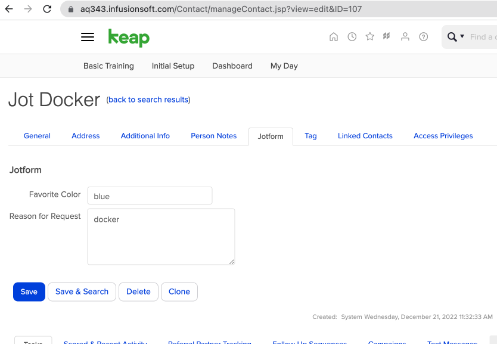

# php-nginx-docker

## Starter Docker

 - Run `docker-compose up` from this root folder
 - Navigate to <http://127.0.0.1:8484>
 - Edit your PHP scripts and files in `./app/public`

## Starter IFS

 - Added supplied IFS repo to `./app/ifs-pbrocks/`
 - Ran `composer install`
 - Adjusted `config.php` file
 - Placed `authorize.php` into `./app/public/` folder
 - Access for at <http://127.0.0.1:8484/jotform/>
 - Setup Keap integration in Jotform
 - Will push contact info to <https://aq343.infusionsoft.com/Dashboard/userDashboard.jsp>
 - Result:

